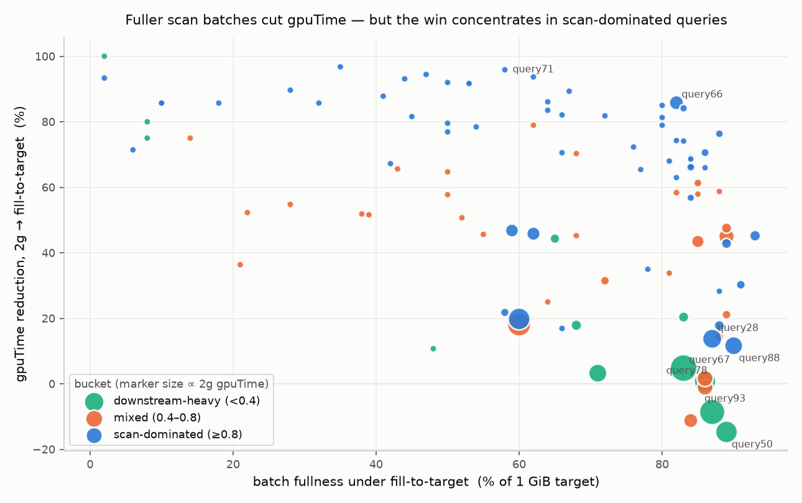

# POC: scan-split sizing to cut GPU work within a runtime budget (NDS SF3k, sparkh) — 2026-07-22

**Question.** Can we change the scan split so **gpuTime and scan time drop**, while keeping **runtime within
+5% of the best achievable runtime**? Best achievable = the `2g` config (172.9 s warm — the floor of the
maxPartitionBytes sweep, `nds-mpb-sweep-perquery-20260720.md`).

**Answer.** Yes, but only *selectively*. A projection-aware split that fills batches (`fill-to-target`) cuts GPU
work a lot but regresses runtime by +25% if applied blindly. Gating it on one run-1 signal —
**scan-dominance ≥ 0.96** — banks **gpuTime −11% with runtime −1.1%** (inside budget).

> **`fill-to-target`** (abbrev. **ftt**) sizes each scan task to decode to ~one full 1 GiB GPU batch:
> `maxSplitBytes = batchSize / (decodedBytes/listedBytes)` (config `-Drapids.autotuner.ratioBasis=listed`).
> **`2g`** is the baseline — Spark's own `maxSplitBytes` at `maxPartitionBytes=2gb`.

Cluster: 8 executors × 16 cores = 128 cores (verified 8 added / 0 removed each run), `concurrentGpuTasks=4`,
AQE on, `metrics.level=DEBUG`, 5 iterations (iter1 cold, 2–5 warm mean). Data read-only
`/user/nvidia/nds/parquet_sf3k_decimal`.

**Full reports** (see the [resource index](#7-resource-index) for every doc, CSV and script):
[maxPartitionBytes baseline sweep](nds-mpb-sweep-perquery-20260720.md) ·
[fill-to-target vs 2g](nds-sf3k-listed-vs-2g-20260721.md) ·
[scan-dominance buckets](nds-sf3k-scandominance-buckets-20260721.md) ·
[per-scan split/fullness](nds-sf3k-perscan-2g-4g-listed-20260721.md).

---

## 1. Formulas

```
fill-to-target split  :  maxSplitBytes = clamp( batchSize / (decodedBytes / listedBytes), floor, 8 GiB )
                 batchSize = 1 GiB GPU target; sizes each task to decode to ~one full 1 GiB batch.
2g split      :  maxSplitBytes = min(maxPartitionBytes=2gb, max(openCost, bytesPerCore))   (autotuner off)
scan_dominance:  scanstage_gpuTime / wholequery_gpuTime           (measured on the 2g run, a run-1 signal)
goal met      :  full%_ftt > full%_2g  AND  gpuTime_ftt < gpuTime_2g  AND  warm_ftt <= 1.05*warm_2g
gated policy  :  apply fill-to-target iff scan_dominance >= 0.96, else keep 2g
```

`fill-to-target` is implemented by `ScanSplitAutotuner.decide` (`-Drapids.autotuner.ratioBasis=listed -Drapids.autotuner.ceiling=8g`,
jar `rapids-ratiobasis-357.jar`); it learns `decodedBytes/listedBytes` per scan on iter1 and applies it iters 2–5.

---

## 2. Headline results

### Aggregate over 103 queries (2g → fill-to-target)

| metric | 2g | fill-to-target | change |
|---|---|---|---|
| scan time (s, task-sec/iter) | 3,247 | 1,879 | **−42%** |
| GPU decode (s) | 1,248 | 635 | **−49%** |
| gpuTime (s) | 4,849 | 3,687 | **−24%** |
| mean batch fullness (% of 1 GiB) | 15% | 63% | **×4.3** |
| WARM runtime (s) | 172.9 | 215.9 | **+25%** ← blind ratio regresses |

`fill-to-target` lowers gpuTime on **98/103** queries and fills batches on **101/103** — but blind application costs
+25% runtime because the larger split cuts scan-task parallelism.

### Gated policy — the POC result

| policy | WARM runtime | gpuTime |
|---|---|---|
| all 2g (baseline / best runtime) | 172.9 s | 4849 |
| all fill-to-target (blind ratio) | 215.9 s (+25%) | 3687 (−24%) |
| **gated (scan_dominance ≥ 0.96)** | **171.0 s (−1.1%)** | **4311 (−11%)** |

Applies to 38 queries (32/38 stay within +5%). `scan_dominance` is the best single separator of winners from
regressors (~83% at threshold ≥ 0.96; batch fullness / avg-batch / GPU-intensity only 63–69%).

---

## 3. How fuller batches help, and how close to the target

Filling batches raises mean fullness from **15% → 63%** of the 1 GiB target (×4.3). That is *why* GPU work drops
— fewer, larger batches mean less per-batch decode/op overhead. But the runtime payoff depends on the bucket:

| bucket (by scan_dominance) | queries | fullness 2g→fill-to-target | gpuTime 2g→fill-to-target | WARM 2g→fill-to-target | goal met |
|---|---|---|---|---|---|
| scan-dominated (≥0.8) | 61 | 16% → 63% | 1819 → 1023 s (**−44%**) | 68.2 → 74.8 s (+10%) | **39/61** |
| mixed (0.4–0.8) | 30 | 10% → 64% | 1396 → 1037 s (−26%) | 60.7 → 89.6 s (+48%) | 2/30 |
| downstream-heavy (<0.4) | 12 | 18% → 58% | 1634 → 1627 s (−0%) | 44.0 → 51.5 s (+17%) | 1/12 |



*One dot per query (marker size ∝ 2g gpuTime). Fuller batches (right) cut gpuTime (up), but only scan-dominated
(blue) queries land high on both; downstream-heavy (green: query50, query93, query67, query78) get fuller batches
yet ~0 or negative gpuTime change — the basis of the gate. Interactive version in the HTML report below.*

**Reading:** fullness rises to ~58–64% in every bucket, but the gpuTime win only *matters* when the scan is the
GPU bottleneck (scan-dominated: −44%). For downstream-heavy queries the GPU time lives in joins/aggs, so fuller
scan batches move gpuTime ~0% and only cost parallelism → runtime regresses. This is the whole basis of the gate.

*How close to target:* fill-to-target lands scans at ~**82–94% full** on the big scans (see §5); the 63% aggregate mean is
pulled down by many tiny dim scans that never reach a full 1 GiB batch regardless of split.

---

## 4. The 42 goal-met queries (39 scan-dominated + 2 mixed + 1 downstream)

Every winner has `scan_dominance ≥ 0.86` (most ≥ 0.98) — the reason 0.96 was chosen as the gate.

**scan-dominated (39):** query66, query47, query71, query28, query88, query99, query9, query59, query70, query2,
query57, query96, query89, query13, query31, query61, query27, query48, query32, query63, query26, query77,
query90, query43, query86, query36, query53, query98, query16, query37, query3, query92, query55, query83,
query58, query52, query42, query12, query20.
**mixed (2):** query23_part2, query21. **downstream (1):** query39_part1.

Representative rows (2g → fill-to-target): query66 `1964→1392 ms, gpuTime 111.4→15.8 s, full 11→82%`;
query71 `2625→2182 ms, gpuTime 14.5→0.6 s, full 3→58%`; query28 `3704→3586 ms, gpuTime 203.8→175.8 s, full 66→87%`.
Full per-query table with all 103 queries by bucket: [nds-sf3k-scandominance-buckets-20260721.md](nds-sf3k-scandominance-buckets-20260721.md).

### Per-query GPU work — all 39 scan-dominated winners (2g → fill-to-target)

`gpuTime` here is **scan-stage** (gpuTime summed over tasks in scan-containing stages), not whole-query — for
these scan-dominated queries the two nearly coincide (1081 vs 1089 task-s), confirming the GPU time really is in
the scan. `decode_s` = Parquet→GPU decode (a subset of scan); `Δwarm` = overall runtime change (negative = faster;
all within +5% by construction); `saved_s` = scan-stage gpuTime task-seconds saved; `gpu↓%` = that as a % of 2g.
**Sorted by seconds saved.** Source `data/mpb-perquery-2g.csv`, `data/mpb-perquery-listedfull.csv`.

| query | warm ms 2g→ftt | Δwarm | decode_s 2g→ftt | scan-stage gpuTime_s 2g→ftt | saved_s | gpu↓% | full% 2g→ftt |
|---|---|---|---|---|---|---|---|
| query66 | 1964→1392 | -29% | 11.8→1.4 | 111.3→15.7 | 95.6 | 86% | 11→82 |
| query36 | 814→834 | +2% | 9.5→1.9 | 33.9→5.4 | 28.5 | 84% | 20→83 |
| query28 | 3704→3586 | -3% | 108.0→91.2 | 202.9→174.9 | 28.0 | 14% | 66→87 |
| query70 | 1070→1000 | -7% | 10.6→1.6 | 35.5→8.4 | 27.1 | 76% | 12→88 |
| query47 | 1342→1093 | -19% | 8.8→1.5 | 38.1→11.2 | 26.9 | 71% | 17→86 |
| query99 | 1148→1122 | -2% | 8.5→4.1 | 57.8→33.1 | 24.7 | 43% | 52→89 |
| query2 | 977→913 | -7% | 15.4→4.6 | 35.6→12.0 | 23.6 | 66% | 17→84 |
| query88 | 2835→2769 | -2% | 105.0→88.4 | 179.6→158.8 | 20.8 | 12% | 49→90 |
| query27 | 697→618 | -11% | 10.4→3.1 | 24.7→6.2 | 18.5 | 75% | 32→83 |
| query31 | 1367→1328 | -3% | 11.9→0.5 | 17.9→1.1 | 16.8 | 94% | 2→67 |
| query86 | 643→652 | +1% | 3.8→0.1 | 17.3→1.0 | 16.3 | 94% | 3→62 |
| query57 | 974→898 | -8% | 6.2→0.5 | 19.9→3.7 | 16.2 | 81% | 9→80 |
| query71 | 2625→2182 | -17% | 6.5→0.3 | 14.2→0.5 | 13.7 | 96% | 3→58 |
| query59 | 1356→1234 | -9% | 19.3→12.5 | 45.1→31.5 | 13.6 | 30% | 48→91 |
| query89 | 780→604 | -23% | 5.6→1.1 | 16.3→5.3 | 11.0 | 67% | 16→84 |
| query26 | 542→498 | -8% | 6.3→1.2 | 13.1→2.7 | 10.4 | 79% | 16→80 |
| query9 | 1425→1354 | -5% | 14.5→11.0 | 57.4→47.2 | 10.2 | 18% | 49→88 |
| query43 | 584→462 | -21% | 4.5→0.7 | 13.6→3.5 | 10.1 | 74% | 12→82 |
| query48 | 645→568 | -12% | 6.6→2.2 | 13.3→4.3 | 9.0 | 68% | 28→84 |
| query61 | 1067→988 | -7% | 4.5→0.5 | 7.3→0.7 | 6.6 | 90% | 5→64 |
| query96 | 1035→1032 | -0% | 11.8→8.7 | 22.3→16.0 | 6.3 | 28% | 49→88 |
| query90 | 519→468 | -10% | 6.0→1.8 | 9.4→3.2 | 6.2 | 66% | 19→86 |
| query63 | 556→490 | -12% | 4.9→1.3 | 8.6→2.6 | 6.0 | 70% | 16→84 |
| query53 | 521→388 | -26% | 4.7→1.2 | 8.1→2.5 | 5.6 | 69% | 16→84 |
| query77 | 771→523 | -32% | 3.9→0.2 | 5.7→0.4 | 5.3 | 93% | 2→44 |
| query13 | 836→836 | +0% | 7.9→5.2 | 14.2→9.2 | 5.0 | 35% | 39→78 |
| query3 | 353→288 | -18% | 3.8→0.5 | 5.9→0.9 | 5.0 | 85% | 10→80 |
| query16 | 1075→1090 | +1% | 26.1→14.6 | 28.4→23.6 | 4.8 | 17% | 34→66 |
| query37 | 441→353 | -20% | 4.0→1.3 | 5.8→2.0 | 3.8 | 66% | 10→42 |
| query32 | 605→501 | -17% | 2.4→0.1 | 3.6→0.2 | 3.4 | 94% | 2→47 |
| query92 | 437→397 | -9% | 2.1→0.1 | 3.1→0.1 | 3.0 | 97% | 1→35 |
| query52 | 360→262 | -27% | 1.4→0.1 | 2.5→0.2 | 2.3 | 92% | 3→53 |
| query42 | 267→274 | +3% | 1.4→0.1 | 2.5→0.2 | 2.3 | 92% | 3→50 |
| query55 | 332→274 | -17% | 1.4→0.1 | 2.3→0.2 | 2.1 | 91% | 3→53 |
| query83 | 536→474 | -12% | 0.6→0.1 | 1.4→0.1 | 1.3 | 93% | 0→2 |
| query98 | 909→864 | -5% | 0.4→0.1 | 0.7→0.1 | 0.6 | 86% | 3→32 |
| query58 | 535→520 | -3% | 0.2→0.1 | 0.7→0.1 | 0.6 | 86% | 2→6 |
| query12 | 414→384 | -7% | 0.4→0.1 | 0.6→0.1 | 0.5 | 83% | 1→10 |
| query20 | 380→392 | +3% | 0.4→0.1 | 0.6→0.1 | 0.5 | 83% | 2→18 |
| **total (39)** | — | — | **462→264** | **1081→589** | **492** | **−46%** | — |

The real contributors are the GPU-heavy scans — **query66 saves 95.6 s**, then query36/28/70/47/99 (~25–29 s each);
tiny queries show large **%** cuts but negligible seconds. Every row: batches get fuller, decode and scan-stage
gpuTime fall together, and warm runtime holds within +5% (most improve). Total scan-stage gpuTime saved on the 39:
**492 s (−46%)**; overall runtime across them **37.4 → 33.9 s**.

---

## 5. maxSplitBytes actually used (store_sales scans, 2g → fill-to-target)

`split_MiB` from the `scanMaxSplitBytes` (ESSENTIAL) driver metric. It **varies per query even at fixed config**
because dynamic partition pruning changes each scan's total bytes, so the split is per-scan, not one global value.

| query | qtime 2g→ftt | split 2g → **fill-to-target** (MiB) | full% 2g → **fill-to-target** |
|---|---|---|---|
| query93 | 0.98× | 2048 → 2286 | 79 → 88 |
| query67 | 0.87× | 583 → 2321 | 20 → 90 |
| query78 | 0.84× | 580 → 1656 | 29 → 92 |
| query14_part1 | 0.87× | 94 → 3888 | 41 → 94 |
| query71 | 1.20× | 98 → 2906 | 4 → 85 |
| query80 | 0.62× | 65 → 1659 | 6 → 82 |
| query28 | 1.03× | 2048 → 2858 | 66 → 87 |
| query88 | 1.02× | 2048 → 3810 | 49 → 91 |

fill-to-target raises the split (often 10–40× on lightly-pruned scans) to fill batches to ~82–94%; that helps runtime only
when the query is scan-dominated. Full per-scan table (every `(query, table)` scan, 2g/4g/fill-to-target):
[nds-sf3k-perscan-2g-4g-listed-20260721.md](nds-sf3k-perscan-2g-4g-listed-20260721.md).

### web_sales scans (top 8 by 2g runtime)

`decode_s` = Parquet→GPU decode; `scanOp_s` = scan-operator GPU op time (task-seconds/iter). Source
`data/mpb-perscan-2g-4g-fill-to-target.csv`.

| query | qtime 2g→ftt | split 2g → fill-to-target (MiB) | full% 2g → ftt | decode_s 2g → ftt | scanOp_s 2g → ftt |
|---|---|---|---|---|---|
| query78 | 0.84× | 220 → 2326 | 7 → 88 | 3.6 → 1.2 | 6.2 → 7.0 |
| query23_part2 | 0.97× | 11 → 3241 | 1 → 39 | 1.2 → 0.1 | 3.3 → 0.5 |
| query23_part1 | 0.95× | 11 → 3241 | 1 → 39 | 1.7 → 0.2 | 2.8 → 0.5 |
| query14_part1 | 0.87× | 35 → 5459 | 11 → 92 | 4.9 → 1.3 | 7.7 → 5.3 |
| query14_part2 | 0.90× | 665 → 5459 | 11 → 92 | 5.1 → 1.5 | 7.4 → 5.5 |
| query75 | 0.73× | 223 → 3262 | 5 → 92 | 3.1 → 0.3 | 6.7 → 2.3 |
| query95 | 0.80× | 1108 → 8106 | 13 → 92 | 5.1 → 0.9 | 16.5 → 2.7 |
| query4 | 0.83× | 222 → 2715 | 6 → 90 | 3.8 → 0.7 | 15.8 → 6.2 |

### catalog scans (top 8 by 2g runtime)

Note: plan-string truncation merges `catalog_sales` / `catalog_returns` / `catalog_page` into `catalog_`; the
large-split, high-decode rows below are `catalog_sales` (the big fact table).

| query | qtime 2g→ftt | split 2g → fill-to-target (MiB) | full% 2g → ftt | decode_s 2g → ftt | scanOp_s 2g → ftt |
|---|---|---|---|---|---|
| query64 | 0.90× | 2048 → 6008 | 6 → 75 | 2.8 → 0.9 | 7.2 → 8.7 |
| query78 | 0.84× | 474 → 2589 | 3 → 66 | 1.2 → 0.5 | 4.4 → 8.9 |
| query23_part2 | 0.97× | 23 → 3557 | 3 → 78 | 0.6 → 0.0 | 1.7 → 0.1 |
| query23_part1 | 0.95× | 23 → 3557 | 3 → 78 | 0.6 → 0.0 | 1.7 → 0.1 |
| query14_part1 | 0.87× | 77 → 6076 | 21 → 95 | 6.4 → 2.4 | 12.6 → 8.3 |
| query14_part2 | 0.90× | 1426 → 6076 | 21 → 95 | 6.5 → 2.4 | 12.4 → 8.3 |
| query75 | 0.73× | 306 → 4631 | 5 → 74 | 3.0 → 0.5 | 11.8 → 5.0 |
| query4 | 0.83× | 474 → 3022 | 12 → 93 | 5.3 → 1.4 | 15.8 → 9.2 |

Across all three big fact tables the story is identical: fill-to-target raises the split several-fold, fills batches to
~66–95%, and cuts decode — the split, not the table, drives it.

---

## 6. Conclusion

- **Fuller batches (15% → 63% of target) cut GPU work substantially** — scan time −42%, decode −49%, gpuTime −24%
  aggregate — because larger splits mean fewer, fuller batches with less per-batch overhead.
- **But fuller ≠ faster.** Blind application regresses runtime +25% by cutting scan-task parallelism; the GPU-work
  win only converts to a runtime win on **scan-dominated** queries.
- **Gating on `scan_dominance ≥ 0.96` meets the goal:** gpuTime −11% at runtime −1.1% (within the +5% budget),
  vs the blind ratio's +25%.

**Caveats (open):** ~6 of the gated queries still misfire; the gate captures ~half the achievable gpuTime win; the
0.96 threshold is fit to this NDS run and should be tunable; per-query metrics are aggregate task-seconds (warm mean),
not wall-clock.

---

## 7. Resource index

### Reports (this directory)

| report | what's in it |
|---|---|
| [nds-sf3k-scandominance-report-20260722.html](nds-sf3k-scandominance-report-20260722.html) | **this POC as a self-contained HTML report** — stat tiles, interactive fullness-vs-gpuTime scatter (hover), and the key tables. |
| [nds-sf3k-fullness-vs-gputime-20260722.png](nds-sf3k-fullness-vs-gputime-20260722.png) | the fullness-vs-gpuTime scatter (static, embedded in §3). |
| [nds-mpb-sweep-perquery-20260720.md](nds-mpb-sweep-perquery-20260720.md) | maxPartitionBytes baseline sweep 128m→4g: config summary (runtime, scan, decode, gpuTime), per-query warm runtime + speedup, and one full per-query metrics table per config. Establishes 2g as the runtime floor. |
| [nds-sf3k-listed-vs-2g-20260721.md](nds-sf3k-listed-vs-2g-20260721.md) | fill-to-target (ratio) vs 2g: aggregate result table, column definitions, and per-query warm/gpuTime/scan/fullness for every query faster under fill-to-target. |
| [nds-sf3k-scandominance-buckets-20260721.md](nds-sf3k-scandominance-buckets-20260721.md) | the 103 queries bucketed by scan_dominance; per-bucket summary + full per-query tables (scan_dom, warm, gpuTime, full%); the run-1-signal comparison and gated-policy result. |
| [nds-sf3k-perscan-2g-4g-listed-20260721.md](nds-sf3k-perscan-2g-4g-listed-20260721.md) | one row per `(query, table)` scan: effective `maxSplitBytes`, full%, decode, scanOp for 2g / 4g / fill-to-target (store_sales top scans). |
| [nds-sf3k-sparkh-ratiobasis-poc-20260720.md](nds-sf3k-sparkh-ratiobasis-poc-20260720.md) | earlier single-query POC (query9) comparing sizing bases (fill-to-target / bytesread / read-budget) and the floor knob. |

### Data (repo `data/`, event logs + CSVs)

| file | contents |
|---|---|
| [data/mpb-perquery-2g.csv](../../../../data/mpb-perquery-2g.csv), `-listedfull.csv`, `-{128m,256m,512m,1g,4g}.csv` | per-query per-config: cold_ms, warm_ms, scan_s, decode_s, scanstage_gpu_s, wq_gpu_s, scan_batches, avg_batch_mib, pct_target |
| [data/mpb-perscan-2g-4g-fill-to-target.csv](../../../../data/mpb-perscan-2g-4g-fill-to-target.csv) | per-`(query,table)` scan: split_MiB, full%, decode, scanOp for 2g/4g/fill-to-target |
| `data/mpb-{cfg}-results/eventlog-test-1` | raw Spark event logs (2g, listedfull, 4g, and the sweep configs) |

### Scripts (`../handoff/`)

| script | role |
|---|---|
| [mpb_perquery.py](../handoff/mpb_perquery.py), [mpb_perscan.py](../handoff/mpb_perscan.py), [mpb_pertable.py](../handoff/mpb_pertable.py) | parse event logs → the per-query / per-scan / per-table CSVs |
| [mpb_scandominance.py](../handoff/mpb_scandominance.py) | bucket by scan_dominance, evaluate the goal criterion + gated policy |
| [mpb_parse.py](../handoff/mpb_parse.py), [mpb_combine.py](../handoff/mpb_combine.py), [mpb_writedoc*.py](../handoff/mpb_writedoc.py) | config-summary parse, CSV join, doc generation |
| [mpb_chart_fullness_gpu.py](../handoff/mpb_chart_fullness_gpu.py), [mpb_writereport.py](../handoff/mpb_writereport.py) | render the fullness-vs-gpuTime PNG scatter; generate the HTML report |
| [run-mpb-sweep.sh](../handoff/run-mpb-sweep.sh) | run one maxPartitionBytes config (full NDS, autotuner off) |
