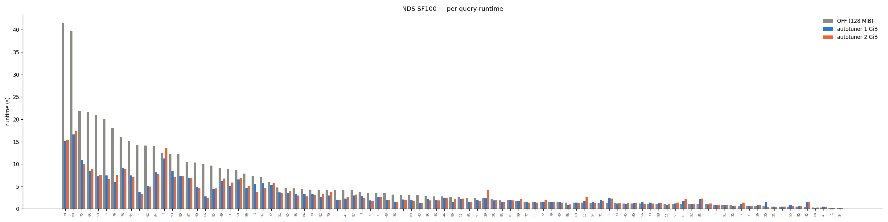
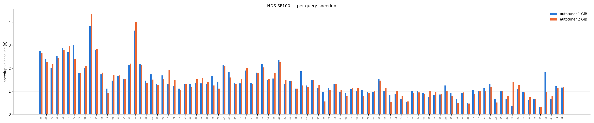
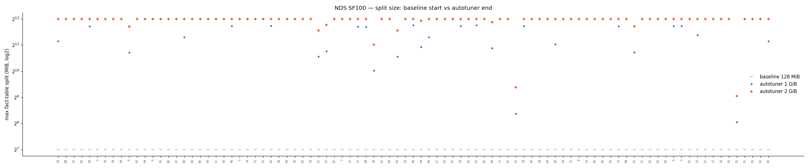

# Scan split autotuner — summary for the team

**Date:** 2026-07-15 · Benchmark: NDS (TPC-DS) all 99 queries, SF100, A5000 GPU, 16 cores.

## The problem

Spark splits input files using a fixed `maxPartitionBytes` (128 MiB by default). For GPU scans
that makes too many small tasks — each task hands the GPU a tiny slice, so per-task overhead
dominates and the GPU is underfed. A single fixed number can't be right for every table, because
tables compress and project differently.

## What the change does

The autotuner sets the split **per table**, learning from that table's own earlier reads:

```
decode ratio = decoded bytes / bytes read from disk      (measured on a prior read)
split        = batch size / decode ratio                 (so one task ≈ one GPU batch of work)
split        = clamp(split, Spark's default, 4 GiB)      (never smaller than today; never above 4 GiB)
```

So a table whose data shrinks when decoded gets a **bigger** split (fewer, fuller tasks); a table
that expands gets a smaller one. It never goes below Spark's default, so it can only help or match —
it can't regress a query relative to the baseline.

## Results (NDS SF100, 99 queries)

| config | total time | vs baseline |
|---|---|---|
| Baseline (128 MiB, autotuner off) | 527.7 s | 1.00× |
| **Autotuner on** | **305.3 s** | **1.73×** |

- Wins concentrate on the big scan-heavy queries: query9 3.8×, query59 2.9×, query28 2.7×,
  query76 3.0×. These read store_sales/web_sales/catalog_sales, where the split grows from 128 MiB
  to 1–4 GiB and the task count drops ~20–30×.
- Small queries are unchanged (their tables are tiny — the split stays at the default).
- Per-query runtimes, speedups, and the split chosen for each fact table are in the standardized
  tables (`nds-batchsize-runtime-table-20260715.txt`, `nds-batchsize-split-table-20260715.txt`).

### Charts

Per-query runtime (baseline vs autotuner 1 GiB vs 2 GiB):



Per-query speedup vs baseline:



Split size — baseline 128 MiB start vs where the autotuner ended up (log scale):



An interactive, self-contained version (charts + full per-query tables, opens in any browser) is at
**`nds-batchsize-report-20260715.html`**.

## Does a bigger GPU batch help?

**(This section is being re-tested — see the reader-only batch experiment.)** The earlier
`batchSizeBytes=2g` run was a *global* change (all operators), not reader-only, so its result is not a
clean answer to "does feeding the reader bigger batches help." A reader-scoped test is in progress.

## Scaling up: SF1000 and SF10000 test plan

The split decision has no total-data-size term — it depends only on the per-table decode ratio, which
does not change with scale. So we expect:

- **Same split sizes** at any scale factor (store_sales still ~4 GiB).
- **Task count grows with the data** (~10× at SF1000, ~100× at SF10000). The baseline scales the same
  way, so the ~20–30× task reduction — and the ~1.7× speedup — should hold.
- **Per-task GPU memory stays flat** (each task still decodes ~one 1 GiB batch), so no new
  out-of-memory risk as data grows.

**What we will measure at SF1000 and SF10000:**
1. Total runtime and speedup, baseline vs autotuner.
2. Per query: runtime, speedup, and the split chosen for each fact table.
3. Scan task counts (baseline vs autotuner) — confirm they scale as expected.
4. Peak GPU memory and any spill/out-of-memory — confirm the design stays safe at scale.
5. Whether the speedup holds, shrinks (if the query becomes spill-bound downstream), or grows
   (if per-task overhead matters more with many more tasks).

**Prerequisites:** generate SF1000 (~1 TB) and SF10000 (~10 TB) NDS parquet; ~10× and ~100× longer
runs; enough local disk for spill.

## Where the data lives

- **Interactive HTML report:** `nds-batchsize-report-20260715.html` (self-contained — open in a browser).
- Standardized tables: `nds-batchsize-runtime-table-20260715.txt`, `nds-batchsize-split-table-20260715.txt`.
- Charts: `nds-batchsize-chart-{runtime,speedup,split}-20260715.png`.
- Raw splits: `nds-batchsize-{off,b1g,b2g}-splits-20260715.csv`.
- Run: `data/nds-batchsize-20260715_211659/` (baseline / autotuner-1GiB / autotuner-2GiB passes).
