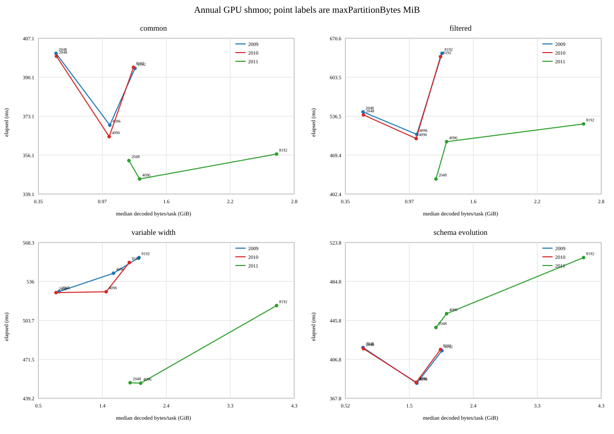
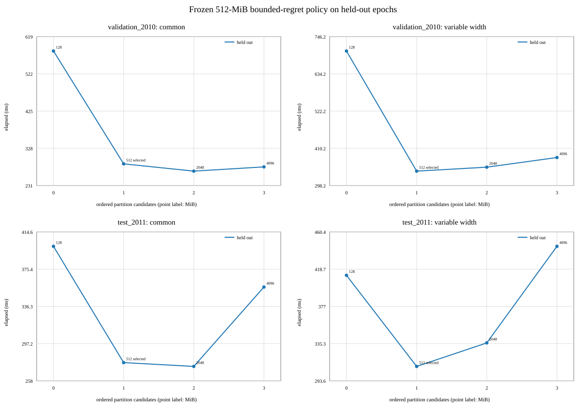
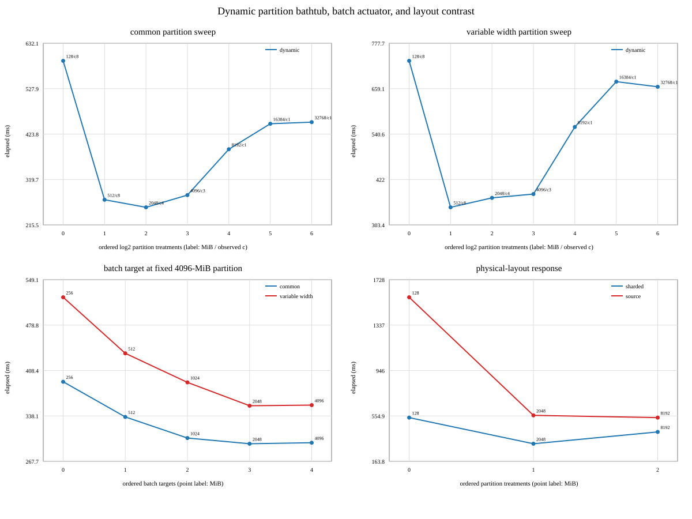
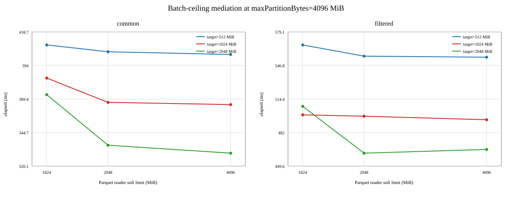
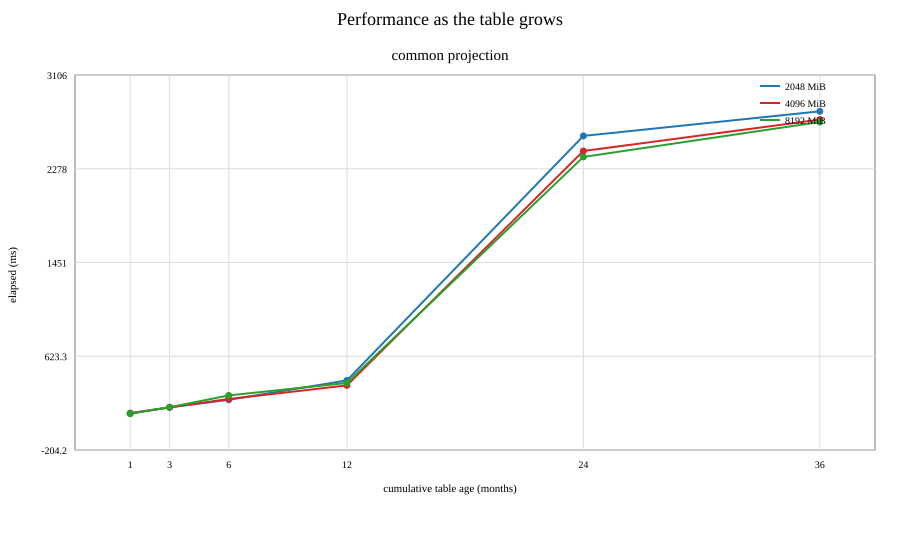

# Uncompressed-size and row-count shmoo for GPU Parquet scans

## Status

**MEASURED LOCALLY — 878 GPU RUNS, 12 CPU REFERENCES, PROSPECTIVE TRANSFER RERUN COMPLETE**

This experiment asks two separate questions:

1. Can Spark planning metadata and prior executions predict decoded GPU rows and bytes?
2. Do decoded rows, task bytes, or emitted-batch bytes predict a useful performance region
   without violating an independent RMM memory bound?

Configured `spark.sql.files.maxPartitionBytes` is a treatment used to move the realized
workload. It is not itself the modeled answer.

## What was run

- Primary: 264 GPU runs; 252 measured runs across 84 cells and three annual epochs.
- High-size sequential extension: 120 GPU runs; 108 measured.
- Batch-control factorial: 164 GPU runs; 162 measured across partition size, general
  RAPIDS batch target, and reader soft limit.
- Cumulative growth and mixed-schema study: 80 GPU runs; 72 measured.
- Dynamic-concurrency mechanism follow-up: 82 GPU runs; 80 measured, including ten
  128-MiB observations per query.
- Independent batch-target follow-up: 52 GPU runs; 50 measured.
- Original-versus-sharded physical-layout contrast: 32 GPU runs; 30 measured.
- Frozen 512-MiB policy prospective transfer rerun: 84 GPU runs; 80 measured across
  2010/2011 previously studied in the original static-concurrency experiment.
- CPU correctness: 12 references, one for every annual episode/query.
- Initial studies used three seeded randomized blocks; follow-ups used five blocks and
  ten default observations. Exact schedules, raw event logs, task metrics, analysis,
  and lifecycle checks are versioned under `attempts/` and `preregistration/`.

All CPU reference hashes match the corresponding GPU hashes. All measured result hashes
are stable within their episode/query. Lifecycle validation found no failed tasks,
executor removal, retry, split-retry, or spill in these lanes.

## Findings

### Planning-time byte prediction works extremely well for the fixed-width lane

For two nullable 64-bit columns, Spark's actual `FilePartition` ranges were joined to
Parquet footer row counts before execution. Footer-predicted task rows matched emitted
scan rows exactly. Given those planned rows,

```text
U_hat = 2 * align64(8 * rows) + 2 * align64(ceil(rows / 8))
```

predicts one-batch cuDF boundary footprint with 0.000439% MAPE and at most 112 bytes
absolute error. The task observations reduce to 1,639 unique planned layouts after
removing repeated blocks and the duplicate common/filtered scan boundary.

The proposed generalization for other fixed-width projections is a sum over columns,
using each column's cuDF
physical width and a validity-mask term only when a mask is present or conservatively
predicted:

```text
U_hat = Σ [align64(cudf_type_width_j * rows)
           + mask_present_or_predicted_j * align64(ceil(rows / 8))]
```

Missing columns requested by the read schema must be modeled explicitly; they are not
necessarily free in GPU output.

### The useful performance region is query- and control-dependent

The primary range did not bracket a turnover: 2,048 MiB configured was fastest in every
annual query cell.

The high-size extension observed a turnover or flattening in several cells, but did not
establish a universal knee. For the 2009 common query:

| Configured MiB | Median task bytes | Median rows/task | Median query time |
|---:|---:|---:|---:|
| 2,048 | 560,258,624 (534 MiB) | 34,477,452 | 400 ms |
| 4,096 | 1,124,430,448 (1,072 MiB) | 69,195,711 | 369 ms |
| 8,192 | 1,388,530,552 (1,324 MiB) | 85,448,028 | 394 ms |

The 8,192-MiB cell was skewed: its p95 task volume was 2,261,826,256 bytes, so median
task size is not a safety bound. Across all annual query cells, the smallest configured
candidate within 5% of the best three-run median was 2,048 or 4,096 MiB. “Within 5%” is
a descriptive heuristic, not a confidence interval.

A candidate selected from the 2009 high-size results had 2011 median-time regret of
0.00% for common, 14.98% for filtered, 0.08% for variable-width, and 3.15% for the
schema-evolution query. No single candidate was within 5% of the best median in every
annual query cell; this exploratory result motivates query/epoch-specific policies but
does not establish that a global default can never be adequate.



### The objective is a bounded bathtub region, not a point optimum

A replayable reanalysis found an extremely linear small-task ramp under the original
static-concurrency-one protocol: across the 12 annual cells, the effective incremental
cost was 31.6–46.0 ms per scan task with minimum R² 0.99975. This is strong evidence
that task-count-correlated overhead dominates the small side in this testbed, although
the slope combines setup, scheduling, semaphore cycles, and other correlated effects.

That original protocol could not identify the large-side admission mechanism because
actual GPU holder concurrency was always one. The preregistered follow-up therefore
enabled dynamic concurrency, used five randomized blocks, and added ten observations at
Spark's 128-MiB default for each of two contrasting projections:

| Query | 128 MiB | 512 MiB | 2,048 MiB | 4,096 MiB | 8,192 MiB |
|---|---:|---:|---:|---:|---:|
| Fixed-width common | 592 ms | 273 ms | **256 ms** | 284 ms | 389 ms |
| Variable-width | 732 ms | **349 ms** | 374 ms | 384 ms | 559 ms |

The right wall appeared before a memory failure. As partitions grew, scan tasks fell
from 87 to 21, 5, 3, and 2; observed maximum simultaneous GPU holders fell from 8 to 8,
4, 3, and 1. At 8,192 MiB the median task boundary grew, but maximum task footprint was
only about 3.4 GiB for common and 2.6 GiB for variable-width, with no retry or spill.
At 16,384/32,768 MiB only one task remained and footprint stopped growing because the
1-GiB batch boundary chunked the partition. Thus the observed cliff is consistent with
lost runnable/admitted parallelism and task granularity, not a demonstrated OOM wall.

A post-sweep minimax calculation across these two queries gave 512 MiB 6.8% worst
observed 2009 point-median regret, versus 7.1% for 2,048 MiB. The 0.3-percentage-point
difference is far below the observed variation, so 512 MiB is a conservative tie-break—not
a uniquely identified optimum—because it retained a three-wave diagnostic proxy and a
much smaller footprint.

The candidate was frozen before an 80-run prospective dynamic-concurrency transfer rerun.
The 2010/2011 epochs were held out from the new 2009 selection calculation, but they had
already been studied under the earlier static-concurrency protocol; this is not an untouched
independent holdout. Against the restricted 128, 512, 2,048, and 4,096-MiB comparator set,
the 512-MiB point-median regrets were 7.07% and 1.46% for common and 0% for
variable-width in both epochs. All four cells passed the preregistered descriptive 10%
point-median criterion, with stable results and no retry/spill. Five blocks do not
confidence-bound true regret below 10%, so this supports a candidate for further transfer
testing rather than validating a universal default.



The proposed wide 4–16× plateau was not supported at the preregistered 5% threshold:
the fixed-width cell contained only 2,048 MiB and the variable-width cell only 512 MiB.
The bootstrap intervals overlap more broadly, so a flat-region conclusion needs more
paired blocks or a predeclared equivalence test. Ten default observations gave CVs of
7.39% and 5.28%; with five treatment blocks, a 5% distinction was below the planning
detectable effect. Exact two-sided sign-flip tests also cannot reach p < 0.0625 with
five pairs, before multiple-comparison correction.



### Batch controls causally change batching and performance in this lane

The full factorial independently varied:

- configured partition size: 2,048 / 4,096 / 8,192 MiB;
- `spark.rapids.sql.batchSizeBytes`: 512 / 1,024 / 2,048 MiB;
- `spark.rapids.sql.reader.batchSizeBytes`: 1,024 / 2,048 / 4,096 MiB.

Holding partition layout fixed, changing the general RAPIDS target moved the maximum
emitted batch boundary to approximately 0.5, 1, or 2 GiB. A lower reader soft limit also
capped the emitted batch. Thus both controls mediate batching.

For the 4,096-MiB common cell, median time was about 367 ms at a 1-GiB general target
and 2-GiB reader limit, versus 330 ms at a 2-GiB general target and 4-GiB reader limit.
At the original 1-GiB target, the largest batch was 1,073,643,664 bytes (about
0.9999 GiB), while cumulative task output was larger and split across batches.

The five-block follow-up fixed the partition treatment at 4,096 MiB and swept the
general target through 256, 512, 1,024, 2,048, and 4,096 MiB. Maximum emitted batches
tracked the target until limited by available task output: common times were 391, 337,
304, 295, and 297 ms; variable-width times were 522, 435, 390, 354, and 355 ms.
The flat 2–4-GiB result and one-batch task output show that, once a task contains enough
data, the batch target directly controls emitted batch size. Partition sizing still controls
available task volume, task count, and how many batches a task can produce. Larger batch
targets also increased observed task footprint, so batch sizing has its own memory wall.

This factorial supports batching mediation; it still does not isolate GPU occupancy,
filesystem cache, scheduling waves, or every reader internal. The application environment
event records the central 1-GiB general target and 2-GiB reader limit; the randomized
per-run mutations are bound by the frozen schedule and journal, then corroborated by the
observed batch response. Spark does not emit a new environment event for each mutation.



### Feedback ratios require the correct numerator and an epoch key

Three byte quantities are distinct:

- `C_split`: sum of Spark-assigned `PartitionedFile.length` values; actuator-facing.
- `C_projected`: projected Parquet column-chunk bytes; footer/model-facing.
- `C_read_task`: Spark TaskMetrics `Bytes Read`; runtime physical read accounting.

The experiment now captures `C_split` from exact planned partitions. A 2009
`C_split / U_projected` ratio transferred with 2.62% MAPE to 2010 common scans but
57.07% MAPE to 2011. Runtime `C_read_task / U_projected` transferred within about
1–2% for the common projection, but it is diagnostic evidence and cannot be inverted
directly into `maxPartitionBytes`.

For the filtered query, the 2009 survivor model transferred to 2010 with 0.96% byte
MAPE and 3.40% `C_split / U_survive` MAPE. In 2011 those errors were 1.03% and 56.76%.
This is why a record must be keyed by table identity, physical schema/codec epoch, read
schema/projection, and predicate family, with footer-domain and drift checks. Requiring
an exact snapshot would prevent useful day/week reuse; reusing across an out-of-domain
epoch would be unsafe.

### Rows versus bytes is not a settled universal choice

A task-level association model trained on 2009 decode time produced 2011 MAPE of 13.19%
for bytes only, 13.55% for rows only, and 13.22% for bytes plus rows. Those models are
descriptive task decode-time associations, not independent observations or an
end-to-end setting selector. Within a fixed schema, bytes and rows are nearly collinear.

The evidence supports retaining both:

- bytes for decoded-volume prediction and as an input to a separate RMM footprint bound;
- rows for saturation, variable-width interpretation, and schema/missing-column effects.

Emitted boundary bytes do not themselves enforce memory safety. The safety actuator must
use a separately calibrated RMM task-footprint upper bound.

### Growth changes waves and sometimes the preferred setting

The cumulative study used 1, 3, 6, 12, 24, and 36 months with a common projection, plus
24/36-month mixed reads where `PULocationID` is absent in older files and present in
2011. The mixed explicit-schema queries completed with stable GPU result hashes.

Small windows collapsed multiple configured settings onto the same physical layout. At
12 months the unique best observed median was 4,096 MiB; at 24 months 4,096 and 8,192
were within 5%; at 36 months all three high-size candidates were within 5%. The
per-task target remained usable, while the whole-query curve changed as task counts,
waves, and tails changed. This study does not isolate those from cache, data/schema drift,
reader behavior, or other scale effects.



This is an explicit-schema missing-column study. It is not evidence that Parquet
automatically up-casts incompatible physical types. The 2011 `payment_type` INT64 epoch
required an explicit read-as-long then cast-to-string adapter above the scan.

### Physical layout is part of the model key

The follow-up ran the same fixed-width query and partition treatments over the original
monthly files and the value-preserving sharded rewrite:

| Layout | 128 MiB | 2,048 MiB | 8,192 MiB |
|---|---:|---:|---:|
| Sharded: time / stage-output-empty tasks | 540 ms / 87-87-0 | 315 ms / 5-5-0 | 417 ms / 2-2-0 |
| Original: time / stage-output-empty tasks | 1,577 ms / 46-12-34 | 560 ms / 3-3-0 | 540 ms / 1-1-0 |

At 128 MiB the original layout planned and launched 46 scan tasks, but only 12
produced output; the other 34 still accumulated a median 3,038 ms of GPU-semaphore
holding time per run in aggregate. They therefore cannot be dropped from the overhead
model even though output-producing tasks remain the denominator for decoded bytes,
batches/task, and the data-bearing GPU-wave proxy.

The knob acted differently because file and row-group layout changed Spark packing,
reader behavior, task granularity, and available concurrency. A per-table policy cannot
be keyed only by logical schema or compression ratio. It needs a current file-size and
row-group census, open-cost/packing configuration, and a drift trigger. The experiment
does not attribute the entire layout difference to any single one of those mechanisms.

## Controller blueprint and implementable signals

This is not yet an end-to-end production selector: the variable-width, RMM upper-bound,
and makespan models remain open. It is a blueprint whose fixed-width inputs, planning
boundary, and feedback signals were exercised locally. For every candidate next-query
layout:

1. Enumerate Spark `FilePartition` / `PartitionedFile` ranges.
2. Map ranges to selected Parquet row groups and sum footer `NumRows`.
3. Predict fixed-width GPU output from requested read-schema widths, validity masks,
   allocator alignment, and explicit missing-column behavior.
4. Predict strings/variable-width columns from projected chunk metadata plus
   schema-epoch history. Abstain or use a conservative bound for unseen epochs.
5. Predict `U_projected` and `R_projected` separately from predicate selectivity and
   `U_survive` / `R_survive`.
6. Predict batches/task from the general RAPIDS target and reader soft limit.
7. Predict RMM task footprint and reject candidates whose upper bound exceeds the
   per-task budget.
8. Predict makespan by list-scheduling planned heterogeneous tasks. Model each task's
   service time from fixed cost plus byte/row-dependent CPU, I/O, and GPU work, then let
   resource availability and dynamic admission create queueing. Do not add measured
   semaphore wait to service time: that double-counts contention. Use wait as a residual
   validation signal, and use Spark's planned scan-stage task count rather than
   `D / maxPartitionBytes`.
9. Build a box, not a point estimate. The lower bound amortizes effective per-task cost.
   The upper bound must satisfy a conservative RMM-footprint bound, retain a predeclared
   number of task-wave opportunities, and stay inside the footer/history domain.
10. Within that box, minimize worst-case regret across prediction uncertainty and matching
    workload families. The follow-up's 512-MiB minimax result is an example calculation,
    not a validated default. If the box is empty or drift is high, retain the fallback and
    collect a new observation.
11. Apply feedback only between queries. For a structurally matching record, compute the
    desired assigned bytes `C_assigned_target = q * U_target` when
    `q = C_split / U_projected`. This is not directly the configuration value: inverse-search
    candidate `maxPartitionBytes` values through the pinned Spark packing simulation,
    including open cost and file/range quantization.

Production integration still requires shim/API design and measurement of driver-side
footer access, metadata caching, packing-simulation cost, and DEBUG metric overhead.
The required signals exist; operational ease and cost are not yet demonstrated.

## Measurement boundaries

- `U_projected_task` / `R_projected_task`: cumulative GPU scan output per task.
- `U_survive_task` / `R_survive_task`: cumulative downstream GPU filter output per task.
- `U_projected_batch_max` / `R_projected_batch_max`: largest emitted scan batch per task.
- `gpuMaxTaskFootprint`: observed task-level GPU footprint used for safety analysis.
- `gpuMaxConcurrentGpuTasks`: maximum simultaneous semaphore holders observed by a task;
  it is not a stage-wide configured/admitted limit.
- `gpuSemaphoreWait`: task wait duration, serialized in event logs at millisecond
  display precision.
- planned scan-stage tasks: Spark's `Stage Info.Number of Tasks`; launched scan tasks
  are counted from all TaskEnd events in that stage. Output-producing scan tasks are the
  subset with positive GPU scan output; empty tasks remain part of scheduling overhead.
  Scan-output byte/row/batch distributions use output-producing tasks. Admission, wait,
  holding, retry/spill, reader, and device-memory metrics use all scan-stage tasks because
  empty tasks can still acquire the GPU; their holding time is also reported separately.
- scan task span: first scan-task launch to last scan-task finish; a critical-path proxy,
  not a complete stage-attribution model.
- `multithreadReaderMaxParallelism`: observed reader-side parallelism when that path is used.

Boundary footprint is not simultaneous residency, allocation traffic, or physical VRAM.

## Corpus and reproducibility

The original 36 monthly files each had one row group, so a direct split sweep was
degenerate. The controlled rewrite contains 825 sub-32-MiB, one-row-group Snappy files
and 516,784,476 rows across six independently rewritten schema strata.

The rewrite preserves row values with high confidence: for every month, source and
derived data match on schema, row count, `bit_xor(xxhash64(all columns))`,
`sum(xxhash64(all columns))`, and every column's null/NaN count. This is a collision-
bounded multiset check, not a mathematical proof.

Spark `repartition` created a balanced synthetic physical layout. It does not preserve
the original file locality or production task skew. Source/derived SHA-256 identities,
footer census, logical schemas, planner census, multiset validation, raw logs, and
replayable analyses are versioned in this experiment directory. External Parquet data
remains ignored by Git.

## Completed versus still open

| Area | Status |
|---|---|
| Exact fixed-width footer-row → GPU-byte chain | Measured and validated |
| Scan and post-filter feedback boundaries | Measured and chronologically scored |
| Exact assigned `C_split` and runtime `C_read_task` | Separated and scored |
| Primary/high-size shmoo | Complete, three descriptive blocks |
| General-target × reader-limit mediation | Complete |
| Dynamic-concurrency bathtub mechanism sweep | Complete; five exploratory blocks |
| Ten-run default variance screen | Complete for common and variable-width |
| Original-versus-sharded physical-layout contrast | Complete |
| Cross-query bounded-regret rule | Descriptive point-median criterion passed in prospective 2010/2011 rerun; confidence-bounded regret and other layouts/families open |
| 1→36-month cumulative growth | Complete |
| Mixed missing/present column read | Complete with explicit schema |
| Annual CPU/GPU correctness and all-study lifecycle checks | Complete |
| M0 projected footer-uncompressed model | Not yet scored |
| M2 combined type/null/chunk feature model | Not yet fitted |
| Confirmatory equivalence bands / untouched independent holdout | Not done; bootstrap cell intervals are descriptive |
| GPU utilization / SM occupancy corroboration | Not measured |
| Automatic compatible Parquet up-casts | Not isolated |
| Multi-executor, multi-GPU, and production skew | Not tested |
| RMM footprint upper-bound model | Metrics captured; natural retry/spill wall remained censored |
| Universal bytes-vs-rows winner | Not supported |

## Artifacts

- Primary: `attempts/full-shmoo-002/RESULTS.md`
- High-size extension: `attempts/high-size-extension-001/RESULTS.md`
- Batch mediation: `attempts/batch-mediation-001/RESULTS.md`
- Growth/mixed schema: `attempts/growth-001/RESULTS.md`
- Annual CPU/GPU correctness: `attempts/cpu-reference-001/analysis/cpu-gpu-correctness.json`
- Planner census: `analysis/planner-census.json`
- Row multiset validation: `analysis/row-multiset-validation.json`
- Bathtub reanalysis: `BATHTUB_RESULTS.md`
- Dynamic follow-up results: `BATHTUB_FOLLOWUP_RESULTS.md`
- Prospective policy transfer results: `BATHTUB_HOLDOUT_RESULTS.md`
- Follow-up execution runbook: `BATHTUB_RUNBOOK.md`
- Follow-up machine analysis: `analysis/bathtub-followup-analysis.json`
- Generated plots: `analysis/annual-shmoo.svg`, `analysis/batch-mediation.svg`,
  `analysis/table-growth.svg`, `analysis/bathtub-followup.svg`, and
  `analysis/bathtub-holdout.svg`
- Reproducibility manifest: `manifest.yaml`
